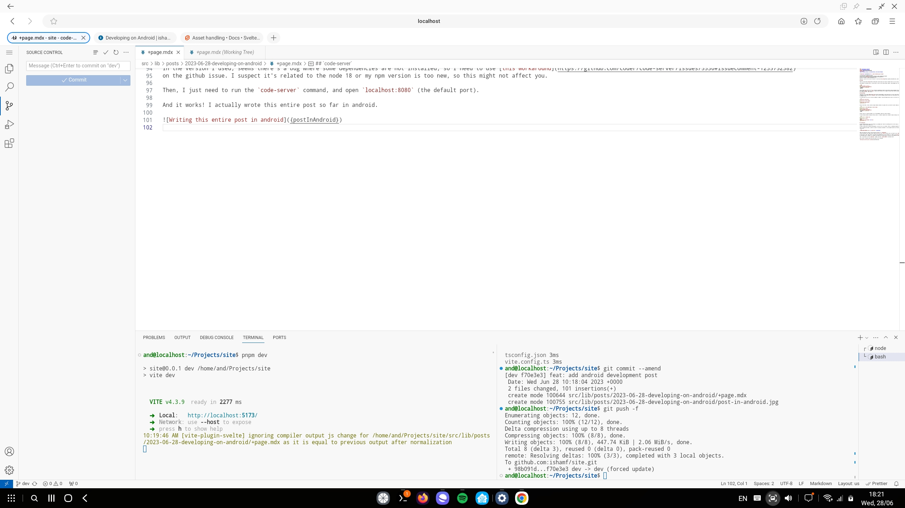

I currently have a Samsung S23 Ultra, which can connect to an external display to show a desktop environment
(a feature called [DeX Mode](https://www.samsung.com/us/apps/dex/)).
And you can connect a mouse and keyboard to it.

Naturally, I want to try to use it to code. I'll start with [this blog](https://github.com/ishamf/site), which needs NodeJS to build. Let's try to run it on Android.

## Termux

There's an app called [Termux](https://termux.dev/) that allows you to open a terminal and run a lot of Linux commands. It also has a package manager so you can install more programs.

Since NodeJS is available there, I could install it and run this blog already. However, some packages don't work well there. The main culprit seems to be the `platform` value returned by NodeJS:

```sh
$ node
Welcome to Node.js v18.16.1.
Type ".help" for more information.
> require('os').platform()
'android'
```

Some packages will check this and use a different implementation based on the platform (mainly packages with native compiled libraries).
If it's not `windows`, `mac`, or `linux`, they will just refuse to run. Though if you edit their code to accept `android` as `linux`, they're able to run normally.
So it seems it's not a real blocker.

## Termux PRoot

Termux has a tool called [PRoot](https://wiki.termux.com/wiki/PRoot), which allows you to run full Linux distributions inside Termux.
I thought this will help with the `platform` issue since the programs inside the distro will think they're running on regular Linux.
So I gave it a try.

It's quite easy to use, just a few short commands is needed. I chose the Debian distro since it's the one I'm most familiar with.

```sh
$ pkg install proot-distro
# ...
$ proot-distro install debian
# ...
$ proot-distro login debian
root@localhost:~#
```

And just like that, I have a (mostly) regular Debian instance on my phone. Now I just need to install nodejs inside, and check what's the platform:

```sh
root@localhost:~# apt update && apt install nodejs
# ...
root@localhost:~# node
Welcome to Node.js v18.13.0.
Type ".help" for more information.
> require('os').platform()
'linux'
```

Success! Since it's basically Debian, all of the packages I need will install normally.

To avoid stupid mistakes bricking my Termux install, I created a separate user instead of always running as root:

```sh
root@localhost:~# adduser and
# ...
root@localhost:~# exit
logout
$ proot-distro login debian --user and
and@localhost:~$
```

## code-server

If your preferred editor runs on the terminal, you probably don't need to do anything extra to start using it.
However, I want to use VS Code on it.

VS Code is mainly built using web technologies, so you can run it in a browser. There's a standalone program to run it called [code-server](https://github.com/coder/code-server).

Since I already have nodejs, I prefer to install it using npm. By default, it only supports node 16, but the default node version of Debian is 18. Since I also used node 18 on my other devices, I forced it to run with 18.

```sh
$ FORCE_NODE_VERSION=18 npm i -g code-server --unsafe-perm
```

Seems the code-server install script explicitly checks for `--unsafe-perm`.
I have no idea why, but I guess since I used the `and` user (not `root`) and this user is not able to use `sudo`, it can't do anything too weird anyway.

In the version I used, seems there's a bug where some dependencies are not installed, so I need to use [this workaround](https://github.com/coder/code-server/issues/5530#issuecomment-1235752382)
on the GitHub issue. I suspect it's related to the node 18 forcing or my npm version is too new, so this might not affect you.

Then, I just need to run the `code-server` command, and open `localhost:8080` (the default port).

And it works! I actually wrote this entire post so far in Android.



## Challenges

There are a few annoying things that I haven't managed to solve yet.

### Browser

Ironically, building and running your app seems to be the easy part. Running VS Code is trickier.

Even after getting `code-server` running, the VS Code UI doesn't work perfectly on mobile browsers. Here are a few issues I found from quickly trying a few browsers:

- Chrome (and a few other chromium-based browsers like Bromite): The mouse hover is not affecting the UI. This actually applies to all websites.
- Firefox: Right-click doesn't work.
- Samsung Internet:
  - Cannot copy-paste to the terminal.
  - `Enter` to accept suggestions doesn't work.
  - Some shortcuts are intercepted by the browser.

In the end, I chose Samsung Internet since its problems at least have workarounds.
I rarely copy-paste to the terminal anyway,
and you can work around it by using the on-screen keyboard's clipboard feature to type it in.
You can also use other buttons to trigger the intercepted actions.

### Using the Touchscreen

A physical keyboard and mouse are basically required. There are a few things you can't do without it. You can type, but I haven't found a keyboard where the function keys or `Ctrl-Shift-P` work. Also, you can't use the touchscreen to select text.

### Web Dev Tools

Most Android browsers don't have web developer tools. The only one I found is [Kiwi Browser](https://github.com/kiwibrowser/src.next).
However, since it's based on chromium, it also cannot show mouse hovers, so you won't be able to fully test desktop websites.

I also tried to use [Eruda](https://github.com/liriliri/eruda) but seems it currently has a [bug](https://github.com/liriliri/eruda/pull/345) where it cannot be opened with the mouse on DeX browsers.

## Conclusion

Depending on what you're doing, coding in Android seems to be completely feasible, though it still has some problems.
It will probably remain as something you can do in a pinch, not something you'd want to do if you have other alternatives.
