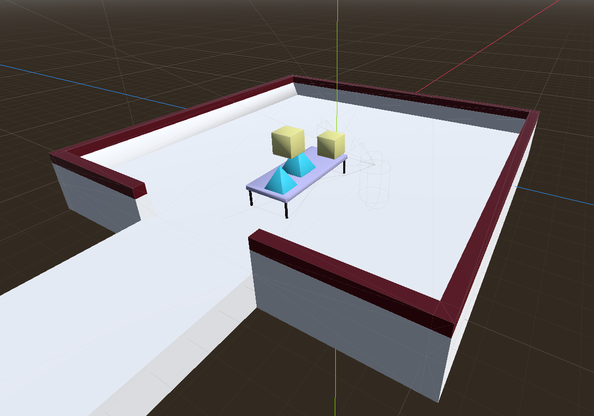

Recently, I played [Viewfinder](https://store.steampowered.com/app/1382070/Viewfinder/), which is a puzzle game with a really interesting mechanic.
You can take photos of the game world, and later "apply" the photo to replace the world behind it.

I thought it would be interesting to try to implement it. I've also wanted to try [Godot Engine](https://godotengine.org/), so I'll be using that to implement the game.

## Creating the Game World

Before we can start with the camera mechanic, we have to have a game in which to apply them.
Since Godot already has a physics system designed for 3D games, it's very easy to create one.
We can just get a bunch of 3D models and import them into Godot as the appropriate entities.

For the scenery, we can add them as a `StaticBody3D`, while for the physics objects, we can add them as a `RigidBody3D`.
The character itself can be created using a `CharacterBody3D`. Then it's just a matter of connecting the input events to the character movement.
It's already very well explained in the [official tutorials](https://docs.godotengine.org/en/stable/getting_started/first_3d_game/index.html), so I won't repeat them here.

## Simple Capturing (Copy and Paste)

To start with, we can implement a very simple version of the algorithm, which is just copying and pasting at the right place.
We can break down the algorithm like this:

1. Find which items are in the camera viewport.
2. Make a copy of those items, and keep their position relative to the player.
3. When the photo is applied, place those copies in the world.

### Finding Items in the Camera

To find the items that are in the viewport, We can take advantage of Godot's collision system.
A camera's viewport is a pyramid, so we can just create an Area3D (collision detection area)
in the shape of a pyramid and place it in the correct location relative to the player.
We can make it very large so it can collide with everything that the player sees.

When it's time to find the items, we can query this collision detector for any items that intersect with it.

### Copying and Pasting Somewhere Else

Like many game engines, Godot uses a [scene graph](https://en.wikipedia.org/wiki/Scene_graph) to organize the game world.
This means that all objects have a parent, and they maintain their position relative to their parent.
For example, in FPS games you can define the camera as a child of the player entity, so it moves when the player moves.

With a scene graph, it's quite simple to implement this. We can make a copy of all visible entities in their current place,
and reparent them to the player while keeping their absolute position. We also need to disable them so they don't interact with the world
as the player moves around.

When we paste the entities later, we just reparent the copy back to the game world.

You might already see a problem with this simple example; the pasted object will overlap with existing objects,
and it will also paste the object parts outside the viewport.
To really sell the photo effect, we need to cut away parts of the 3D models when we're copying and pasting.

## Cutting the Models using Constructive Solid Geometry

[Constructive solid geometry](https://en.wikipedia.org/wiki/Constructive_solid_geometry) is a way to create 3D models by using Boolean operations
between other 3D models, such as intersection and subtraction.
We can use these to cut away the models when copying and pasting.

Conveniently, Godot already [implemented these algorithms](https://docs.godotengine.org/en/stable/tutorials/3d/csg_tools.html)!
We can use the same pyramid we used for collision detection to do these CSG operations.

When copying, instead of keeping the entire copy of the model, we can keep only the parts of the model that intersect with the viewport pyramid.

When pasting the photo, we query the collision detector, and for each model that intersects it, we keep only parts of the model that do not intersect
with the viewport pyramid.

The CSG implementation in Godot is not designed for this. They're quite clear that these algorithms are intended for level prototyping,
where there's a lot of time to compute the resulting model. So it seems they require 1 frame after the CSG models are set up
before the resulting model is available.

After digging through the source code, I found that there's an internal [`_update_shape`](https://github.com/godotengine/godot/blob/master/modules/csg/csg_shape.cpp#L294)
function that is responsible for generating the model. Calling this function makes the model available immediately, so we can use it.

With this, the implementation is finished. [Try it yourselves here!](https://games.ishamf.dev/camera-scene-capture/)

import vidMp4 from './cscc.mp4?url';
import vidWebM from './cscc.webm?url';

<video autoplay muted controls loop>
  <source src={vidWebM} />
  <source src={vidMp4} />
</video>

Well, it's still relatively simple. The original game has a lot more polish, from what I remember:

- Keep track and apply the skybox behind the items.
- Bake the lighting to the static models. Together with the above, the rendered image doesn't change at all before and after applying a photo.
- Apply the correct texture for the parts of the model cut away. They had watermelons that you could cut to expose the red flesh inside.
- Update the weights of the physics objects based on how much they're cut.
- Probably many more things that I didn't even notice.

Still, it's quite a good learning experience. You can check out the [source code in its GitHub repo](https://github.com/ishamf/camera-scene-capture).

## Addendum: Deploying the Game to the Web

Godot has a web export, but there are some complications. For one, it uses shared memory which requires some isolation headers to be sent
by the server. It also generates a big 27MB `.wasm` bundle. I use Cloudflare Pages for this site, but its size limit is 25MB, so I can't deploy the game using the same method.
In the end, I set up a [separate domain and HTTP server](https://games.ishamf.dev/camera-scene-capture/) for it.
